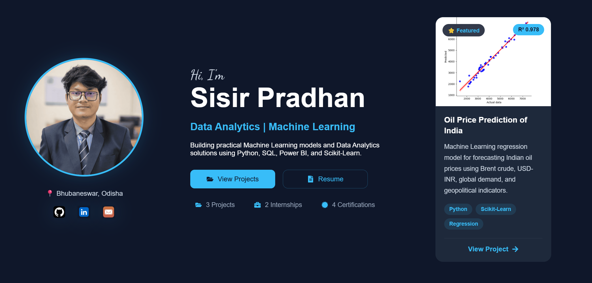

# 🌐 Sisir Pradhan | Portfolio

A modern, responsive portfolio showcasing my journey in **Data Analytics** and **Machine Learning**. Built with **React** and **Vite**, featuring real-world projects, internships, certifications, and an interactive timeline.

## 🚀 Live Demo

🔗 https://sisir-portfolio.vercel.app/

---

## 📸 Portfolio Preview



---

## ✨ Features

- 🎨 Modern & Responsive UI
- 📱 Mobile, Tablet & Desktop Optimized
- 🚀 Interactive Journey Timeline
- 📊 Featured Machine Learning Project
- 💼 Internship & Certification Showcase
- 📁 Project Gallery
- 📄 Resume Download
- 📬 Contact Section
- 🔍 SEO Optimized
- ⚡ Performance Optimized
- ♿ Accessibility Improved
- 🌙 Smooth Animations

---

## 🛠️ Tech Stack

### Frontend

- React
- Vite
- JavaScript (ES6+)
- HTML5
- CSS3

### Libraries

- React Icons

### Deployment

- Vercel

---

## 📂 Project Structure

```text
src/
 ├── components/
 ├── App.jsx
 ├── App.css
 └── main.jsx

public/
 ├── images/
 ├── Certificates/
 └── Resume/
```

---

## 💼 Featured Projects

### 🛢️ Oil Price Prediction of India

Machine Learning regression model for forecasting Indian oil prices using:

- Brent Crude Price
- USD-INR Exchange Rate
- Global Oil Demand
- Geopolitical Indicators

**Tech**

- Python
- Scikit-Learn
- Pandas
- NumPy
- Matplotlib

---

### 🏏 IPL Dashboard

Interactive Power BI dashboard providing insights into IPL player performances, centuries, and statistics.

---

### 📈 Inflation Prediction

Machine Learning project focused on predicting inflation trends using historical economic indicators.

---

## ⚙️ Installation

```bash
git clone https://github.com/Sisir-Pradhan07/Sisir_Portofolio.git

cd Sisir_Portofolio

npm install

npm run dev
```

---

## 📱 Responsive Design

Optimized for:

- 💻 Desktop
- 📱 Mobile
- 📲 Tablet

---

## 📊 Lighthouse Scores

| Metric | Score |
|---------|------:|
| Performance (Desktop) | 91 |
| Performance (Mobile) | 71 |
| Accessibility | 99 |
| Best Practices | 100 |
| SEO | 100 |

---

## 📬 Contact

📧 pradhansisir789@gmail.com

💼 LinkedIn

https://www.linkedin.com/in/sisir-pradhan-b5032724a

💻 GitHub

https://github.com/Sisir-Pradhan07

---

## 📄 License

This project is open source and available under the MIT License.

---

⭐ If you like this portfolio, consider giving the repository a star.